<div align="center">


# Paper2Any

[](https://www.python.org/)
[](LICENSE)
[](https://github.com/OpenDCAI/Paper2Any)
[](https://github.com/OpenDCAI/Paper2Any/stargazers)

English | [中文](README_CN.md)

<a href="https://trendshift.io/repositories/17634" target="_blank"></a>

✨ **Focus on paper multimodal workflows: from paper PDFs/screenshots/text to one-click generation of model diagrams, technical roadmaps, experimental plots, and slide decks** ✨

| 📄 **Universal File Support** &nbsp;|&nbsp; 🎯 **AI-Powered Generation** &nbsp;|&nbsp; 🎨 **Custom Styling** &nbsp;|&nbsp; ⚡ **Lightning Speed** |

<br>

<a href="#-quick-start" target="_self">
  
</a>
<a href="http://dcai-paper2any.nas.cpolar.cn/" target="_blank">
  
</a>
<a href="docs/" target="_blank">
  
</a>
<a href="docs/contributing.md" target="_blank">
  
</a>
<a href="#wechat-group" target="_self">
  
</a>

<br>
<br>


</div>


## 📑 Table of Contents

- [🔥 News](#-news)
- [✨ Core Features](#-core-features)
- [📸 Showcase](#-showcase)
- [🧩 Drawio](#-drawio)
- [🚀 Quick Start](#-quick-start)
- [📂 Project Structure](#-project-structure)
- [🗺️ Roadmap](#️-roadmap)
- [🤝 Contributing](#-contributing)

---

## 🔥 News

> [!TIP]
> 🆕 <strong>2026-03-28 · Editable PPT Showcase Refresh</strong><br>
> Added two new <strong>editable PPT</strong> showcase screenshots for the frontend-deck workflow:<br>
> a generated multi-slide gallery view and the canvas editing workspace with deck theme lock.

> [!TIP]
> 🆕 <strong>2026-03-26 · Workflow Showcase Update</strong><br>
> Added showcase coverage for <strong>Paper2Video</strong>, <strong>Paper2Poster</strong>, and <strong>Paper2Citation</strong>.<br>
> The README now includes a compressed video demo plus refreshed English/Chinese workflow previews.

> [!TIP]
> 🆕 <strong>2026-02-02 · Paper2Rebuttal</strong><br>
> Added rebuttal drafting support with structured response guidance and image-aware revision prompts.

> [!TIP]
> 🆕 <strong>2026-01-28 · Drawio Update</strong><br>
> Added Drawio support for visual diagram creation and showcase-ready outputs in the workflow.<br>
> KB updates in one line: multi-file PPT generation with doc convert/merge, optional image injection, and embedding-assisted retrieval.

> [!TIP]
> 🆕 <strong>2026-01-25 · New Features</strong><br>
> Added **AI-assisted outline editing**, **three-layer model configuration system** for flexible model selection, and **user points management** with daily quota allocation.<br>
> 🌐 Online Demo: <a href="http://dcai-paper2any.nas.cpolar.cn/">http://dcai-paper2any.nas.cpolar.cn/</a>

> [!TIP]
> 🆕 <strong>2026-01-20 · Bug Fixes</strong><br>
> Fixed bugs in experimental plot generation (image/text) and resolved the missing historical files issue.<br>
> 🌐 Online Demo: <a href="http://dcai-paper2any.nas.cpolar.cn/">http://dcai-paper2any.nas.cpolar.cn/</a>

> [!TIP]
> 🆕 <strong>2026-01-14 · Feature Updates & Backend Architecture Upgrade</strong><br>
> 1. **Feature Updates**: Added **Image2PPT**, optimized **Paper2Figure** interaction, and improved **PDF2PPT** effects.<br>
> 2. **Standardized API**: Refactored backend interfaces with RESTful `/api/v1/` structure, removing obsolete endpoints for better maintainability.<br>
> 3. **Dynamic Configuration**: Supported dynamic model selection (e.g., GPT-4o, Qwen-VL) via API parameters, eliminating hardcoded model dependencies.<br>
> 🌐 Online Demo: <a href="http://dcai-paper2any.nas.cpolar.cn/">http://dcai-paper2any.nas.cpolar.cn/</a>

- 2025-12-12 · Paper2Figure Web public beta is live
- 2025-10-01 · Released the first version <code>0.1.0</code>

---

## ✨ Core Features

> From paper PDFs / images / text to **editable** scientific figures, slide decks, video scripts, academic posters, and other multimodal content in one click.

Paper2Any currently includes the following sub-capabilities:

- **📊 Paper2Figure - Editable Scientific Figures**: Model architecture diagrams, technical roadmaps (PPT + SVG), and experimental plots with editable PPTX output.
- **🧩 Paper2Diagram / Image2Drawio - Editable Diagrams**: Generate draw.io diagrams from paper/text or images, with drawio/png/svg export and chat-based edits.
- **🎬 Paper2PPT - Editable Slide Decks**: Paper/text/topic to PPT, long-doc support, and built-in table/figure extraction.
- **📝 Paper2Rebuttal**: Draft structured rebuttals and revision responses with claims-to-evidence grounding.
- **🖼️ PDF2PPT - Layout-Preserving Conversion**: Accurate layout retention for PDF → editable PPTX.
- **🖼️ Image2PPT - Image to Slides**: Convert images or screenshots into structured slides.
- **🎨 PPTPolish - Smart Beautification**: AI-based layout optimization and style transfer.
- **🎬 Paper2Video**: Generate video scripts and narration assets.
- **🖼️ Paper2Poster - Academic Poster**: Turn paper PDFs into poster-ready layouts with configurable sections, logos, and export assets.
- **🔎 Paper2Citation - Citation Explorer**: Track citing authors, institutions, and notable downstream works from author names or DOI/paper URLs.
- **📝 Paper2Technical**: Produce technical reports and method summaries.
- **📚 Knowledge Base (KB)**: Ingest/embedding, semantic search, and KB-driven PPT/podcast/mindmap generation.

---

## 📸 Showcase

### 🧩 Drawio

<div align="center">

<table>
  <tr>
    <td width="33%" align="center" valign="top">
      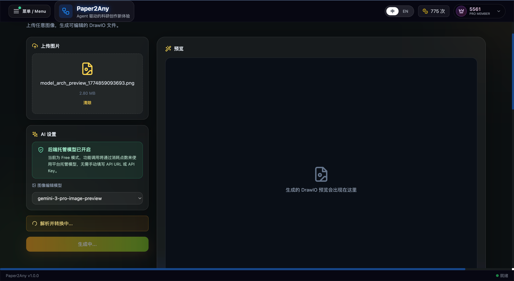
      <br><sub>✨ Upload a paper figure or screenshot as the starting point</sub>
    </td>
    <td width="34%" align="center" valign="top">
      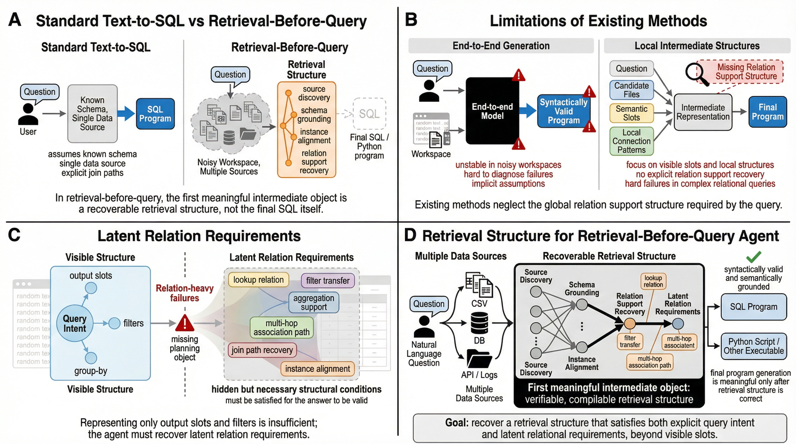
      <br><sub>✨ Keep the source structure visible before conversion</sub>
    </td>
    <td width="33%" align="center" valign="top">
      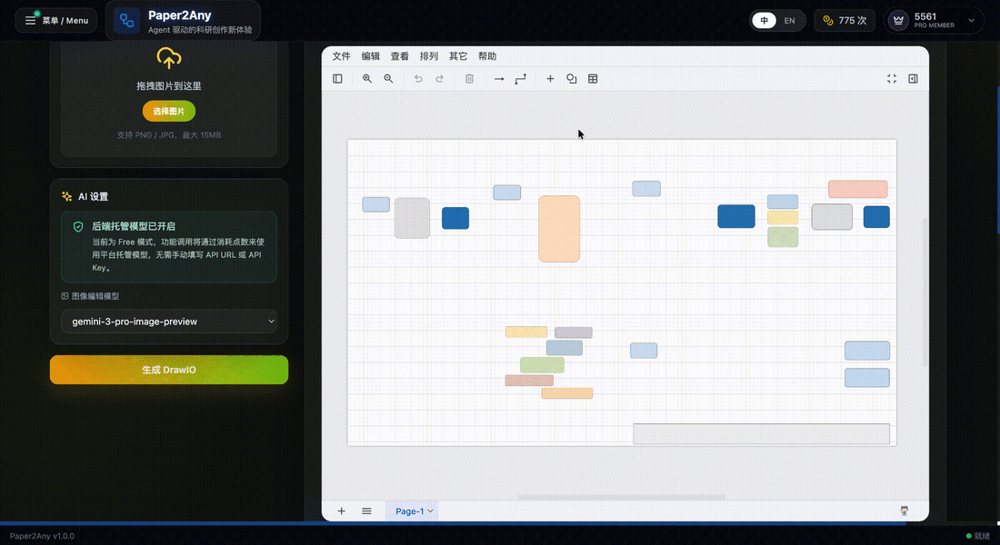
      <br><sub>✨ Convert the image into an editable DrawIO canvas</sub>
    </td>
  </tr>
</table>

<br>

<table>
  <tr>
    <td width="48%" align="center" valign="top">
      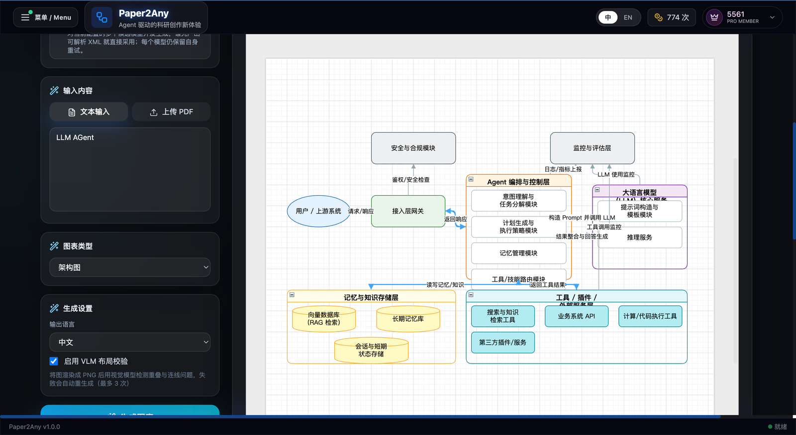
      <br><sub>✨ Generate a model or system diagram directly inside the DrawIO workbench</sub>
    </td>
    <td width="52%" align="center" valign="top">
      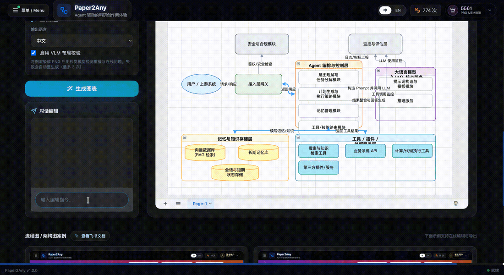
      <br><sub>✨ Refine the generated architecture with chat editing and export-ready layout</sub>
    </td>
  </tr>
</table>

</div>

---

### 📝 Paper2Rebuttal: Rebuttal Drafting

<div align="center">

<br>
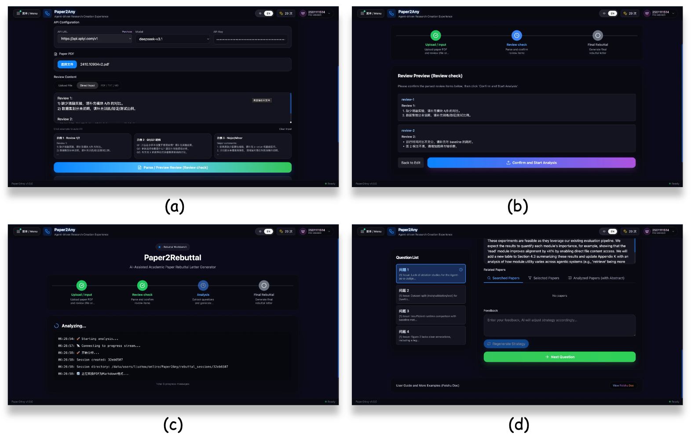
<br><sub>✨ Rebuttal drafting and revision support</sub>

</div>

---

### 📊 Paper2Figure: Scientific Figure Generation

<div align="center">

<br>

<br><sub>✨ Model Architecture Diagram Generation</sub>

<br>

<br><sub>✨ Model Architecture Diagram Generation</sub>

<br><br>
<table>
  <tr>
    <td width="56%" align="center" valign="top">
      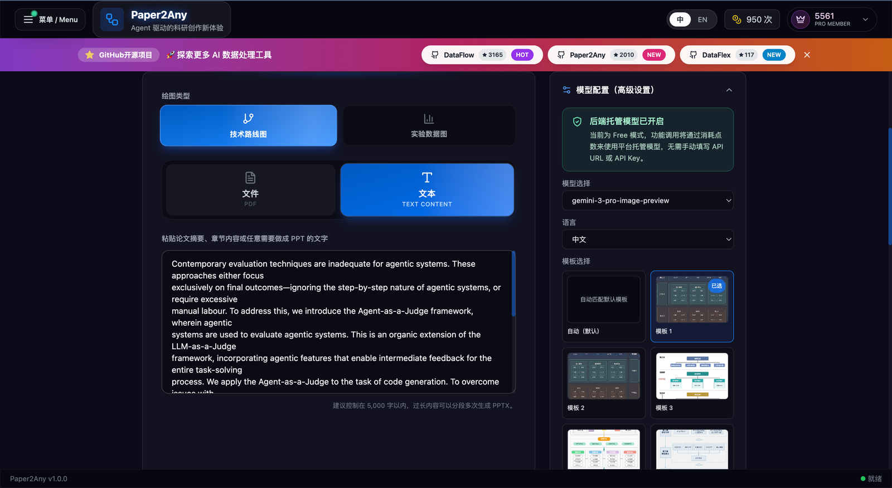
      <br><sub>✨ Technical roadmap workbench: choose route type, input source, model config, and visual template</sub>
    </td>
    <td width="44%" align="center" valign="top">
      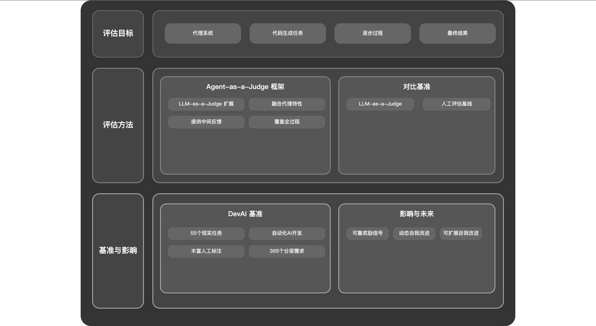
      <br><sub>✨ Generated technical roadmap figure with structured dual-column layout</sub>
    </td>
  </tr>
</table>

<br><br>

<br><sub>✨ Experimental Plot Generation (Multiple Styles)</sub>

</div>

---

### 🎬 Paper2PPT: Paper to Presentation

<div align="center">

<table>
  <tr>
    <td width="50%" align="center" valign="top">
      
      <br><sub>✨ End-to-end PPT generation demo</sub>
    </td>
    <td width="50%" align="center" valign="top">
      
      <br><sub>✨ Paper / text / topic to polished slide deck</sub>
    </td>
  </tr>
</table>

<br>

<table>
  <tr>
    <td width="50%" align="center" valign="top">
      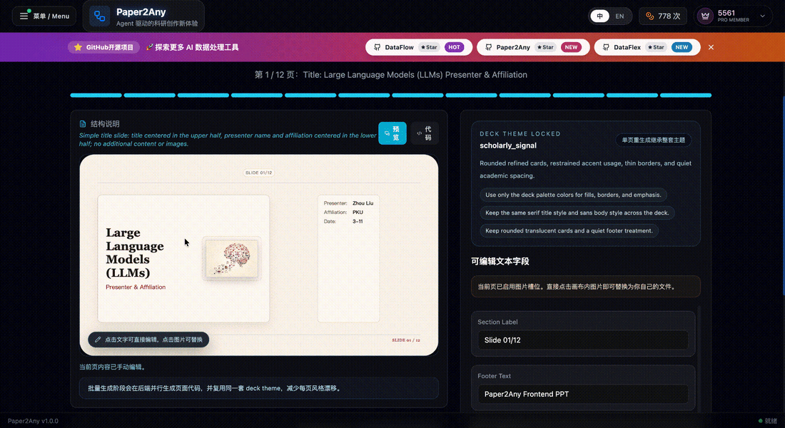
      <br><sub>✨ Edit slide text directly on canvas while keeping the deck theme locked</sub>
    </td>
    <td width="50%" align="center" valign="top">
      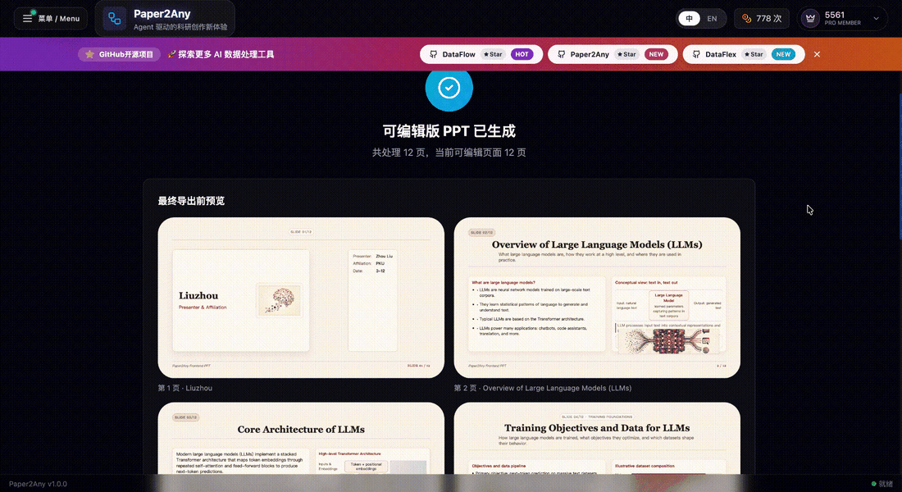
      <br><sub>✨ Review the generated multi-page gallery before export</sub>
    </td>
  </tr>
</table>

<br>

<table>
  <tr>
    <td width="50%" align="center" valign="top">
      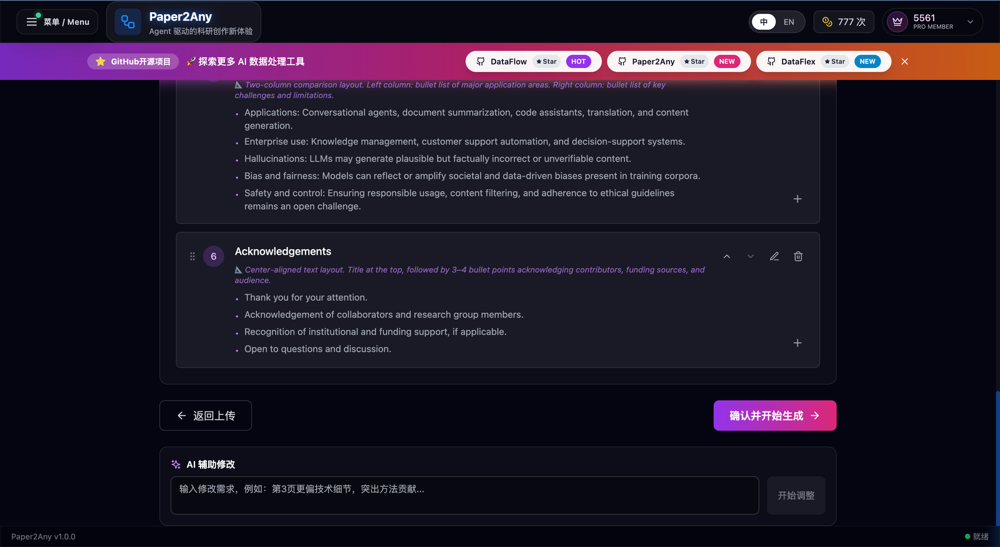
      <br><sub>✨ AI-assisted outline refinement with targeted rewrite prompts</sub>
    </td>
    <td width="50%" align="center" valign="top">
      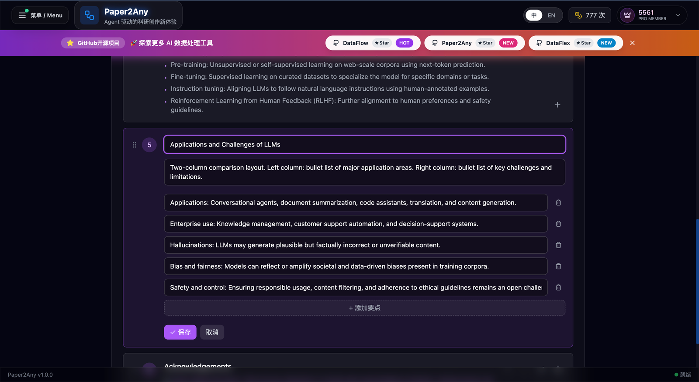
      <br><sub>✨ Structured outline editing down to section and bullet detail</sub>
    </td>
  </tr>
</table>

<br>


<br>

<br>

<br><sub>✨ Long document support for 40+ slides · Intelligent table extraction and insertion · Version history and iterative deck management</sub>

</div>

---

### 🎬 Paper2Video: PPT to Narrated Video

<div align="center">

<br>

<br><sub>✨ PPT / PDF to narrated video with script confirmation, Aliyun TTS voices, and downloadable output</sub>

</div>

---

### 🖼️ Paper2Poster: Paper to Poster

<div align="center">

<br>
<table>
  <tr>
    <td align="center" width="50%">
      
      <br><sub>PNG poster result</sub>
    </td>
    <td align="center" width="50%">
      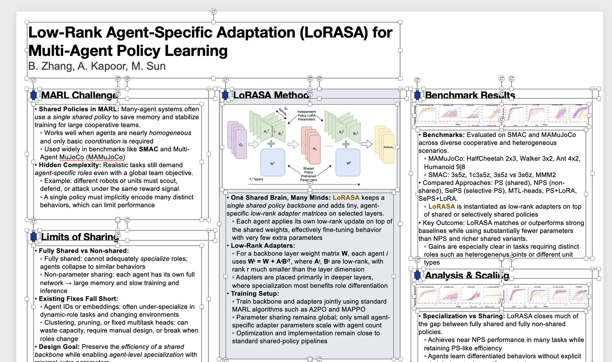
      <br><sub>PPT poster result</sub>
    </td>
  </tr>
</table>
<br><sub>✨ Paper PDF to academic poster with configurable layout, editable poster output, and one-click export</sub>

</div>

---

### 🔎 Paper2Citation: Citation Explorer

<div align="center">

<br>
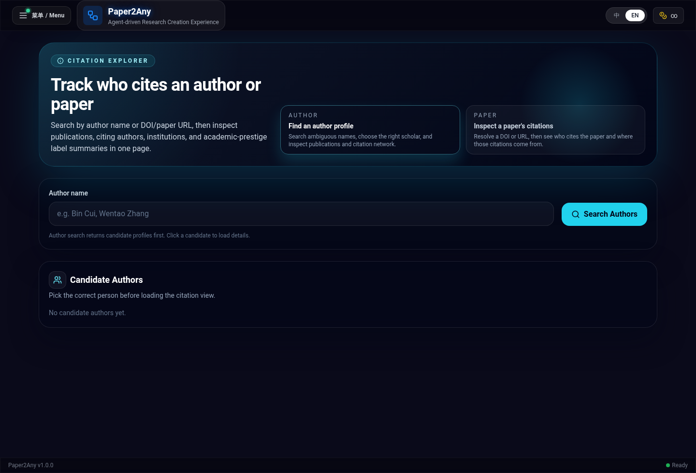
<br><sub>✨ Search authors or papers to inspect citation candidates, institutions, and downstream citation context</sub>

</div>

---

### 🎨 PPT Smart Beautification

<div align="center">

<br>

<br><sub>✨ AI-based Layout Optimization</sub>

<br>

<br><sub>✨ AI-based Layout Optimization & Style Transfer</sub>

</div>

---

### 🖼️ PDF2PPT: Layout-Preserving Conversion

<div align="center">

<br>

<br><sub>✨ Intelligent Cutout & Layout Preservation</sub>

<br>

<br><sub>✨ Image2PPT</sub>

</div>

---

## 🚀 Quick Start

### Requirements


<details>
<summary><strong>🐳 Docker (Recommended) — Deployment & Updates</strong></summary>

```bash
# 1. Clone
git clone https://github.com/OpenDCAI/Paper2Any.git
cd Paper2Any

# 2. Configure environment variables
cp fastapi_app/.env.example fastapi_app/.env
cp frontend-workflow/.env.example frontend-workflow/.env
cp deploy/docker.env.example deploy/docker.env
```

**Required configuration:**

`fastapi_app/.env` (backend):
```bash
# Internal API auth key. Must match frontend VITE_API_KEY.
BACKEND_API_KEY=your-backend-api-key

# Required: Your LLM API URL (replace with your own)
DEFAULT_LLM_API_URL=https://api.openai.com/v1/

# Optional: DrawIO OCR / VLM service
PAPER2DRAWIO_OCR_API_URL=https://dashscope.aliyuncs.com/compatible-mode/v1
PAPER2DRAWIO_OCR_API_KEY=your_dashscope_key

# Optional: MinerU official remote API
MINERU_API_BASE_URL=https://mineru.net/api/v4
MINERU_API_KEY=your_mineru_api_key

# Optional: SAM3 segmentation service for PDF2PPT / Image2PPT / Image2Drawio
# SAM3_SERVER_URLS=http://GPU_MACHINE_IP:8001
# SAM3_SERVER_URLS=http://GPU1:8021,http://GPU2:8022

# Optional: Supabase (skip for no auth — core features still work)
# SUPABASE_URL=https://your-project-id.supabase.co
# SUPABASE_ANON_KEY=your_supabase_anon_key
```

`frontend-workflow/.env` (frontend):
```bash
# Must match BACKEND_API_KEY in fastapi_app/.env
VITE_API_KEY=your-backend-api-key

# Usually keep VITE_API_BASE_URL empty in Docker, because nginx proxies /api and /outputs
VITE_API_BASE_URL=

# Optional: Supabase (keep consistent with backend)
# VITE_SUPABASE_URL=https://your-project-id.supabase.co
# VITE_SUPABASE_ANON_KEY=your_supabase_anon_key
```

`deploy/docker.env` (compose overrides):
```bash
BACKEND_PORT=8000
FRONTEND_PORT=3000
DOCKER_APP_WORKERS=1

# Optional: enable local SAM3 container by running DOCKER_WITH_SAM3=1 bash deploy/docker-up.sh
SAM3_PORT=8021
SAM3_SERVER_URLS=
```

```bash
# 3. Build + run
bash deploy/docker-up.sh
```

Open:
- Frontend: http://localhost:3000
- Backend health: http://localhost:8000/health

> **GPU services note:** Docker starts backend + frontend by default.
> - Paper2PPT, Paper2Figure, Knowledge Base, etc. only need LLM APIs and work out of the box.
> - **PDF2PPT, Image2PPT, Image2Drawio** require SAM3 segmentation.
> - You can either point backend `.env` to an external SAM3 service with `SAM3_SERVER_URLS=...`,
>   or start the optional local SAM3 compose profile:
>   ```bash
>   DOCKER_WITH_SAM3=1 bash deploy/docker-up.sh
>   ```
>
> See the "Advanced: Local Model Server Load Balancing" section below for details.

Modify & update:
- After changing code or `.env`, rebuild: `bash deploy/docker-up.sh`
- Pull latest code and rebuild:
  - `git pull`
  - `bash deploy/docker-up.sh`

Common commands:
- View logs: `bash deploy/docker-logs.sh`
- Stop services: `bash deploy/docker-down.sh`
- Build only: `bash deploy/docker-build.sh`

Notes:
- The first build may take a while (system deps + Python deps).
- Frontend env is baked at build time. If you change `frontend-workflow/.env` or `deploy/docker.env`, rebuild with `bash deploy/docker-up.sh`.
- Outputs/models are mounted to the host (`./outputs`, `./models`) for persistence.

</details>

### 🐧 Linux Installation

> We recommend using Conda to create an isolated environment (Python 3.11).  

#### 1. Create Environment & Install Base Dependencies

```bash
# 0. Create and activate a conda environment
conda create -n paper2any python=3.11 -y
conda activate paper2any

# 1. Clone repository
git clone https://github.com/OpenDCAI/Paper2Any.git
cd Paper2Any

# 2. Install base dependencies
pip install -r requirements-base.txt

# 3. Install in editable (dev) mode
pip install -e .
```

#### 2. Install Paper2Any-specific Dependencies (Required)

Paper2Any involves LaTeX rendering, vector graphics processing as well as PPT/PDF conversion, which require extra dependencies.

The dependency boundary is now:
- `requirements-base.txt`: shared cross-platform Python runtime
- `requirements-paper.txt`: paper / PDF / figure extras
- `requirements-cu12.txt`: NVIDIA CUDA 12 Linux GPU extras
- `requirements-system-ubuntu.txt`: Ubuntu/Debian system packages, not Python packages

```bash
# 1. Paper / PDF / figure Python extras
pip install -r requirements-paper.txt

# 2. NVIDIA GPU runtime extras (Linux + CUDA 12 only)
pip install -r requirements-cu12.txt

# 3. LaTeX engine (tectonic) - recommended via conda
conda install -c conda-forge tectonic -y

# 4. Resolve doclayout_yolo dependency conflicts (Important)
pip install doclayout_yolo --no-deps

# 5. System dependencies (Ubuntu example; full list is mirrored in requirements-system-ubuntu.txt)
sudo apt-get update
sudo apt-get install -y ffmpeg inkscape libreoffice poppler-utils wkhtmltopdf
```

> [!IMPORTANT]
> `ffmpeg`, `libreoffice/soffice`, `inkscape`, `poppler-utils`, `wkhtmltopdf`, and `tectonic`
> are external system tools. They are not installed by `pip`, and `deploy/start*.sh`
> does not auto-install them.

#### 3. Environment Variables

```bash
export DF_API_KEY=your_api_key_here
export DF_API_URL=xxx  # Optional: if you need a third-party API gateway
export MINERU_DEVICES="0,1,2,3" # Optional: MinerU task GPU resource pool
```

> [!TIP]
> 📚 **For detailed configuration guide**, see [Configuration Guide](docs/guides/configuration.md) for step-by-step instructions on configuring models, environment variables, and starting services.

#### 4. Configure Environment Files (Optional)

<details>
<summary><strong>📝 Click to expand: Detailed .env Configuration Guide</strong></summary>

Paper2Any uses two `.env` files for configuration. **Both are optional** - you can run the application without them using default settings.

##### Step 1: Copy Example Files

```bash
# Copy backend environment file
cp fastapi_app/.env.example fastapi_app/.env

# Copy frontend environment file
cp frontend-workflow/.env.example frontend-workflow/.env
```

##### Step 2: Backend Configuration (`fastapi_app/.env`)

**Supabase (Optional)** - Only needed if you want user authentication and cloud storage:
```bash
SUPABASE_URL=https://your-project-id.supabase.co
SUPABASE_ANON_KEY=your_supabase_anon_key
```

**Model Configuration** - Customize which models to use for different workflows:
```bash
# Default LLM API URL
DEFAULT_LLM_API_URL=http://123.129.219.111:3000/v1/

# Workflow-level defaults
PAPER2PPT_DEFAULT_MODEL=gpt-5.1
PAPER2PPT_DEFAULT_IMAGE_MODEL=gemini-3-pro-image-preview
PDF2PPT_DEFAULT_MODEL=gpt-4o
# ... see .env.example for full list
```

**Service Integration Configuration** - External or local services used by image/PDF workflows:
```bash
# DrawIO OCR / VLM
PAPER2DRAWIO_OCR_API_URL=https://dashscope.aliyuncs.com/compatible-mode/v1
PAPER2DRAWIO_OCR_API_KEY=your_dashscope_key

# MinerU official remote API; if MINERU_API_KEY is empty, backend falls back to local MINERU_PORT
MINERU_API_BASE_URL=https://mineru.net/api/v4
MINERU_API_KEY=your_mineru_api_key
MINERU_API_MODEL_VERSION=vlm

# SAM3 segmentation service for PDF2PPT / Image2PPT / Image2Drawio
# One endpoint:
SAM3_SERVER_URLS=http://127.0.0.1:8001
# Or multiple endpoints for load balancing:
# SAM3_SERVER_URLS=http://127.0.0.1:8021,http://127.0.0.1:8022
```

##### Step 3: Frontend Configuration (`frontend-workflow/.env`)

**LLM Provider Configuration** - Controls the API endpoint dropdown in the UI:
```bash
# Default API URL shown in the UI
VITE_DEFAULT_LLM_API_URL=https://api.apiyi.com/v1

# Available API URLs in the dropdown (comma-separated)
VITE_LLM_API_URLS=https://api.apiyi.com/v1,http://b.apiyi.com:16888/v1,http://123.129.219.111:3000/v1
```

**What happens when you modify `VITE_LLM_API_URLS`:**
- The frontend will display a **dropdown menu** with all URLs you specify
- Users can select different API endpoints without manually typing URLs
- Useful for switching between OpenAI, local models, or custom API gateways

**Supabase (Optional)** - Uncomment these lines if you want user authentication:
```bash
VITE_SUPABASE_URL=https://your-project.supabase.co
VITE_SUPABASE_ANON_KEY=your-anon-key
SUPABASE_SERVICE_ROLE_KEY=your-service-role-key
SUPABASE_JWT_SECRET=your-jwt-secret
```

##### Running Without Supabase

If you skip Supabase configuration:
- ✅ All core features work normally
- ✅ CLI scripts work without any configuration
- ❌ No user authentication or quotas
- ❌ No cloud file storage

</details>

> [!NOTE]
> **Quick Start:** You can skip the `.env` configuration entirely and use CLI scripts directly with `--api-key` parameter. See [CLI Scripts](#️-cli-scripts-command-line-interface) section below.

---

<details>
<summary><strong>Advanced Configuration: Local Model Service Load Balancing</strong></summary>

If you are deploying in a high-concurrency local environment, you can use `script/start_model_servers.sh` to start a local model service cluster (MinerU / SAM / OCR).

Script location: `/DataFlow-Agent/script/start_model_servers.sh`

**Main configuration items:**

- **MinerU (PDF Parsing)**
  - `MINERU_MODEL_PATH`: Model path (default `models/MinerU2.5-2509-1.2B`)
  - `MINERU_GPU_UTIL`: GPU memory utilization (default 0.85)
  - **Instance configuration**: By default, one instance is started on each configured GPU, ports 8011-8013.
  - **Load Balancer**: Port 8010, automatically dispatches requests.

- **SAM3 (Segment Anything Model 3)**
  - **Instance configuration**: By default, one instance per configured GPU, ports 8021-8022.
  - **Model assets**: default paths are `./models/sam3/sam3.pt` and `./models/sam3/bpe_simple_vocab_16e6.txt.gz`.
  - **Load Balancer**: Port 8020.

- **OCR (PaddleOCR)**
  - **Config**: Runs on CPU, uses uvicorn's worker mechanism (4 workers by default).
  - **Port**: 8003.

> Before using, please modify `gpu_id` and the number of instances in the script according to your actual GPU count and memory.

For local one-command development test on a single GPU (SAM3 + backend + frontend), run:

```bash
bash script/start_local_sam3_dev.sh
```

</details>

---

### 🪟 Windows Installation

> [!NOTE]
> We currently recommend trying Paper2Any on Linux / WSL. If you need to deploy on native Windows, please follow the steps below.

#### 1. Create Environment & Install Base Dependencies

```bash
# 0. Create and activate a conda environment
conda create -n paper2any python=3.12 -y
conda activate paper2any

# 1. Clone repository
git clone https://github.com/OpenDCAI/Paper2Any.git
cd Paper2Any

# 2. Install base dependencies
pip install -r requirements-win-base.txt

# 3. Install in editable (dev) mode
pip install -e .
```

#### 2. Install Paper2Any-specific Dependencies (Recommended)

Paper2Any involves LaTeX rendering and vector graphics processing, which require extra dependencies:

```bash
# Python dependencies
pip install -r requirements-paper.txt

# NVIDIA GPU runtime extras (Linux only; skip on Windows)
# pip install -r requirements-cu12.txt

# tectonic: LaTeX engine (recommended via conda)
conda install -c conda-forge tectonic -y
```

**🎨 Install Inkscape (SVG/Vector Graphics Processing | Recommended/Required)**

1. Download and install (Windows 64-bit MSI): [Inkscape Download](https://inkscape.org/release/inkscape-1.4.2/windows/64-bit/msi/?redirected=1)
2. Add the Inkscape executable directory to the system environment variable Path (example): `C:\Program Files\Inkscape\bin\`

> [!TIP]
> After configuring the Path, it is recommended to reopen the terminal (or restart VS Code / PowerShell) to ensure the environment variables take effect.

#### ⚡ Install Windows Build of vLLM (Optional | For Local Inference Acceleration)

Release page: [vllm-windows releases](https://github.com/SystemPanic/vllm-windows/releases)  
Recommended version: 0.11.0

```bash
pip install vllm-0.11.0+cu124-cp312-cp312-win_amd64.whl
```

> [!IMPORTANT]
> Please make sure the `.whl` matches your current environment:
> - Python: cp312 (Python 3.12)
> - Platform: win_amd64
> - CUDA: cu124 (must match your local CUDA / driver)

#### Launch Application

**Paper2Any - Paper Workflow Web Frontend (Recommended)**

```bash
# Configure local backend runtime (single source of truth)
# Edit deploy/app_config.sh:
#   APP_PORT=8000
#   APP_WORKERS=2

# Start backend API
./deploy/start.sh

# Start frontend (new terminal)
cd frontend-workflow
npm install
npm run dev
```

Default local addresses:
- Frontend dev server: http://localhost:3000
- Backend health: http://127.0.0.1:8000/health

Useful local deploy commands:
- Start backend: `./deploy/start.sh`
- Stop backend: `./deploy/stop.sh`
- Restart backend: `./deploy/restart.sh`

Notes:
- `deploy/start.sh` and `deploy/stop.sh` both read the same runtime config from `deploy/app_config.sh`.
- If you change `APP_PORT`, update the frontend proxy target in `frontend-workflow/vite.config.ts` as well.

**Configure Frontend Proxy**

Modify `server.proxy` in `frontend-workflow/vite.config.ts`:

```typescript
export default defineConfig({
  plugins: [react()],
  server: {
    port: 3000,
    open: true,
    allowedHosts: true,
    proxy: {
      '/api': {
        target: 'http://127.0.0.1:8000',  // FastAPI backend address
        changeOrigin: true,
      },
      '/outputs': {
        target: 'http://127.0.0.1:8000',
        changeOrigin: true,
      },
    },
  },
})
```

Visit `http://localhost:3000`.

**Windows: Load MinerU Pre-trained Model**

```powershell
# Start in PowerShell
vllm serve opendatalab/MinerU2.5-2509-1.2B `
  --host 127.0.0.1 `
  --port 8010 `
  --logits-processors mineru_vl_utils:MinerULogitsProcessor `
  --gpu-memory-utilization 0.6 `
  --trust-remote-code `
  --enforce-eager
```

---

### Launch Application

#### 🎨 Web Frontend (Recommended)

```bash
# Configure deploy/app_config.sh first if you want to change the local port/workers

# Start backend API
./deploy/start.sh

# Start frontend (new terminal)
cd frontend-workflow
npm install
npm run dev
```

Visit `http://localhost:3000`.
Backend health is available at `http://127.0.0.1:8000/health` by default.

---

### 🖥️ CLI Scripts (Command-Line Interface)

Paper2Any provides standalone CLI scripts that accept command-line parameters for direct workflow execution without requiring the web frontend/backend.

#### Environment Variables

Configure API access via environment variables (optional):

```bash
export DF_API_URL=https://api.openai.com/v1  # LLM API URL
export DF_API_KEY=sk-xxx                      # API key
export DF_MODEL=gpt-4o                        # Default model
```

#### Available CLI Scripts

**1. Paper2Figure CLI** - Generate scientific figures (3 types)

```bash
# Generate model architecture diagram from PDF
python script/run_paper2figure_cli.py \
  --input paper.pdf \
  --graph-type model_arch \
  --api-key sk-xxx

# Generate technical roadmap from text
python script/run_paper2figure_cli.py \
  --input "Transformer architecture with attention mechanism" \
  --input-type TEXT \
  --graph-type tech_route

# Generate experimental data visualization
python script/run_paper2figure_cli.py \
  --input paper.pdf \
  --graph-type exp_data
```

**Graph types:** `model_arch` (model architecture), `tech_route` (technical roadmap), `exp_data` (experimental plots)

**2. Paper2PPT CLI** - Convert papers to PPT presentations

```bash
# Basic usage
python script/run_paper2ppt_cli.py \
  --input paper.pdf \
  --api-key sk-xxx \
  --page-count 15

# With custom style
python script/run_paper2ppt_cli.py \
  --input paper.pdf \
  --style "Academic style; English; Modern design" \
  --language en
```

**3. PDF2PPT CLI** - One-click PDF to editable PPT

```bash
# Basic conversion (no AI enhancement)
python script/run_pdf2ppt_cli.py --input slides.pdf

# With AI enhancement
python script/run_pdf2ppt_cli.py \
  --input slides.pdf \
  --use-ai-edit \
  --api-key sk-xxx
```

**4. Image2PPT CLI** - Convert images to editable PPT

```bash
# Basic conversion
python script/run_image2ppt_cli.py --input screenshot.png

# With AI enhancement
python script/run_image2ppt_cli.py \
  --input diagram.jpg \
  --use-ai-edit \
  --api-key sk-xxx
```

**5. PPT2Polish CLI** - Beautify existing PPT files

```bash
# Basic beautification
python script/run_ppt2polish_cli.py \
  --input old_presentation.pptx \
  --style "Academic style, clean and elegant" \
  --api-key sk-xxx

# With reference image for style consistency
python script/run_ppt2polish_cli.py \
  --input old_presentation.pptx \
  --style "Modern minimalist style" \
  --ref-img reference_style.png \
  --api-key sk-xxx
```

> [!NOTE]
> **System Requirements for PPT2Polish:**
> - LibreOffice: `sudo apt-get install libreoffice` (Ubuntu/Debian)
> - pdf2image: `pip install pdf2image`
> - poppler-utils: `sudo apt-get install poppler-utils`

#### Common Options

All CLI scripts support these common options:

- `--api-url URL` - LLM API URL (default: from `DF_API_URL` env var)
- `--api-key KEY` - API key (default: from `DF_API_KEY` env var)
- `--model NAME` - Text model name (default: varies by script)
- `--output-dir DIR` - Custom output directory (default: `outputs/cli/{script_name}/{timestamp}`)
- `--help` - Show detailed help message

For complete parameter documentation, run any script with `--help`:

```bash
python script/run_paper2figure_cli.py --help
```

---

## 📂 Project Structure

```
Paper2Any/
├── dataflow_agent/          # Core codebase
│   ├── agentroles/         # Agent definitions
│   │   └── paper2any_agents/ # Paper2Any-specific agents
│   ├── workflow/           # Workflow definitions
│   ├── promptstemplates/   # Prompt templates
│   └── toolkits/           # Toolkits (drawing, PPT generation, etc.)
├── fastapi_app/            # Backend API service
├── frontend-workflow/      # Frontend web interface
├── static/                 # Static assets
├── script/                 # Script tools
└── tests/                  # Test cases
```

---

## 🗺️ Roadmap

<table>
<tr>
<th width="35%">Feature</th>
<th width="15%">Status</th>
<th width="50%">Sub-features</th>
</tr>
<tr>
<td><strong>📊 Paper2Figure</strong><br><sub>Editable Scientific Figures</sub></td>
<td></td>
<td>
<br>
<br>
<br>

</td>
</tr>
<tr>
<td><strong>🧩 Paper2Diagram</strong><br><sub>Drawio Diagrams</sub></td>
<td></td>
<td>
<br>
<br>
<br>

</td>
</tr>
<tr>
<td><strong>🎬 Paper2PPT</strong><br><sub>Editable Slide Decks</sub></td>
<td></td>
<td>
<br>
<br>
<br>
<br>
<br>

</td>
</tr>
<tr>
<td><strong>🖼️ PDF2PPT</strong><br><sub>Layout-Preserving Conversion</sub></td>
<td></td>
<td>
<br>
<br>

</td>
</tr>
<tr>
<td><strong>🖼️ Image2PPT</strong><br><sub>Image to Slides</sub></td>
<td></td>
<td>
<br>

</td>
</tr>
<tr>
<td><strong>🎨 PPTPolish</strong><br><sub>Smart Beautification</sub></td>
<td></td>
<td>
<br>
<br>

</td>
</tr>
<tr>
<td><strong>📚 Knowledge Base</strong><br><sub>KB Workflows</sub></td>
<td></td>
<td>
<br>
<br>

</td>
</tr>
<tr>
<td><strong>🎬 Paper2Video</strong><br><sub>Video Script Generation</sub></td>
<td></td>
<td>
<br>

</td>
</tr>
</table>

---

## 🤝 Contributing

We welcome all forms of contribution!

[](https://github.com/OpenDCAI/Paper2Any/issues)
[](https://github.com/OpenDCAI/Paper2Any/discussions)
[](https://github.com/OpenDCAI/Paper2Any/pulls)

---

## 📄 License

This project is licensed under [Apache License 2.0](LICENSE).

<!-- ---

## Star History

[](https://star-history.com/#OpenDCAI/Paper2Any&Date) -->

---

<div align="center">

**If this project helps you, please give us a ⭐️ Star!**

[](https://github.com/OpenDCAI/Paper2Any/stargazers)
[](https://github.com/OpenDCAI/Paper2Any/network/members)

<br>

<a name="wechat-group"></a>

<br>
<sub>Scan to join the community WeChat group</sub>

<p align="center"> 
  <em> ❤️ Made with by OpenDCAI Team</em>
</p>

</div>
